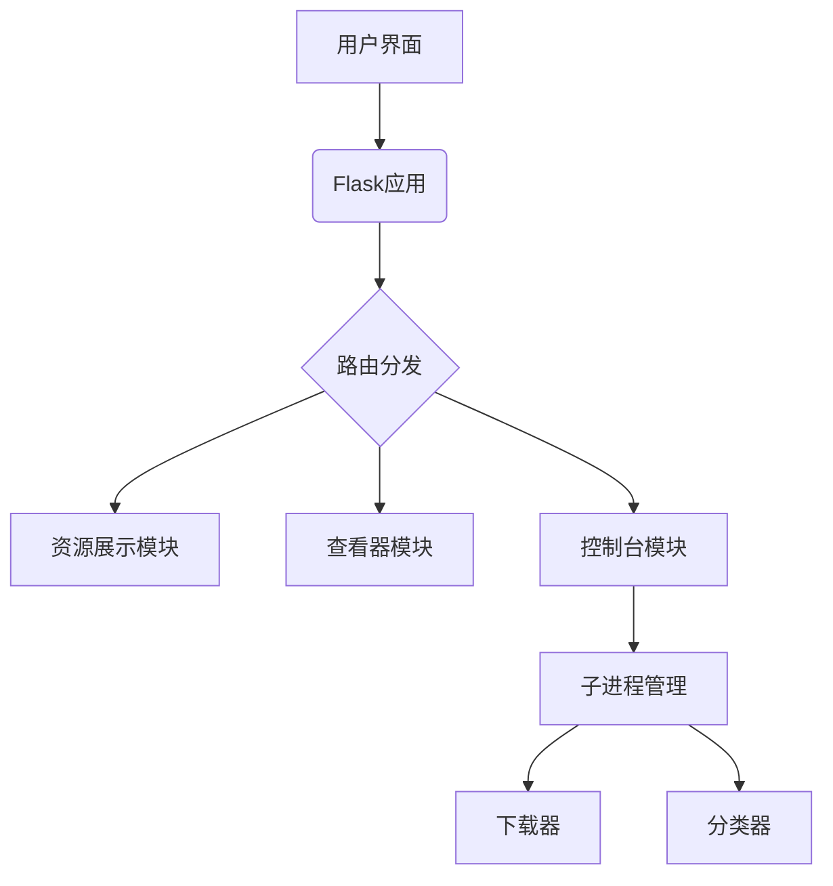
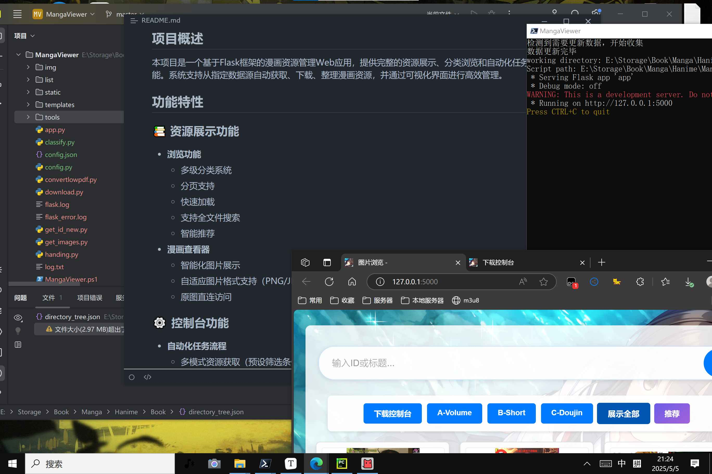
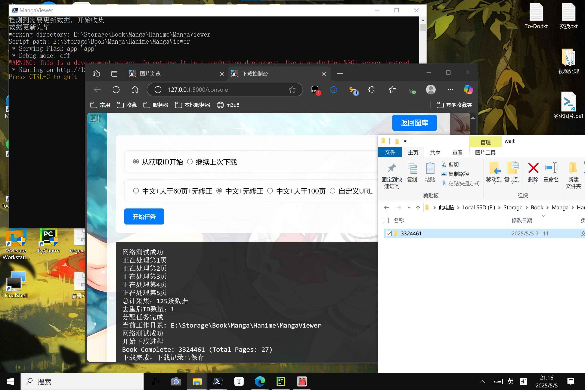
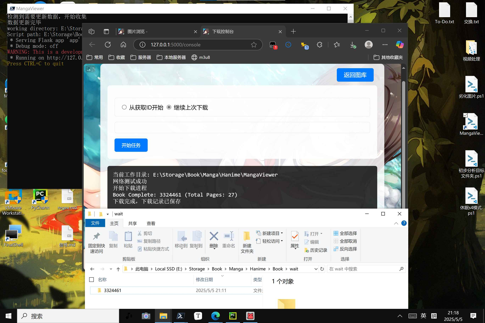

# MangaViewer
[](https://flask.palletsprojects.com/)
[](https://www.python.org/)
[](LICENSE)

## 项目概述

本项目是一个基于Flask框架的漫画资源管理Web应用，提供完整的资源展示、分类浏览和自动化任务执行功能。系统支持从指定数据源自动获取、下载、整理漫画资源，并通过可视化界面进行高效管理。

## 功能特性

### 📚 资源展示功能

- **浏览功能**
  - 多级分类系统
  - 桌面端，移动端优化
  - 分页支持
  - 快速加载
  - 支持全文件搜索
  - 智能推荐
- **漫画查看器**
  - 智能化图片展示
  - 自适应图片格式支持
  - 原图直连访问

### ⚙️ 控制台功能

- **自动化任务流程**
  - 多模式资源获取
  - 断点续传支持
  - 实时进度输出
- **任务管理**
  - 进程状态监控
  - 线程安全输出缓冲
  - 异常中断处理

### ⚙️小工具

- 支持批量将漫画导出pdf
- 支持自动分类
- 支持powershell启动


## 技术栈
### 系统设计



### 优化设计

- **性能优化**
  - LRU缓存加速 (`@lru_cache(maxsize=3000)`)
  - 零拷贝文件传输 (`send_from_directory`)
  - 分页算法 (`per_page=100`)
- **安全机制**
  - 路径消毒 (`unquote`)
  - 端口冲突检测 (`socket.bind`)

## 🚀 快速入门

### ⚙️配置示例

```json
{
    "root_dir": "book",
    "json_path": "book/directory_tree.json",
    "script_path": "",
    "python_executable": "your/python/path",
    "app_host": "0.0.0.0",
    "app_port": "5002",
    "downloadPdfPath": "PDF",
    "pdf_folders": [
        "PDF"
    ]
}
```
至少还需要配置"python_executable"才可运行

### ⚙️分类示例
可以取消注释代码来运行自动分类的功能，自动分类的功能较为简陋。

```python
# app.py
# 这里取决与用户是否决定要开启自动分类
# commands.append([pythonExe, os.path.join(scriptPath, 'classify.py')])
```
```txt
作者自用：
r'Book\A-Volume\A-Detailed',
r'Book\A-Volume\B-Average',
r'Book\A-Volume\C-Censored',
r'Book\A-Volume\D-Borderline',
r'Book\A-Volume\E-Color',
r'Book\A-Volume\F-Scanned',
r'Book\B-Short\A-Monochrome',
r'Book\B-Short\B-color',
r'Book\C-Doujin\A-Monochrome',
r'Book\C-Doujin\B-Color',
r'Book\C-Doujin\C-Extreme',
r'Book\C-Doujin\D-LGBTQ'
```

### ⚙️启动

1. 确保playwright以及对应依赖运行正常，requirements.txt依赖正常安装。

```bash
# 克隆项目
git clone https://github.com/yoshinosuki/MangaViewer.git
cd MangaViewer

# 安装依赖
pip install -r requirements.txt
playwright install
```

2. 项目中提供了两种启动的方式。
```bash
# powershell启动
./MangaViewer.ps1
```

```bash
# python启动
python get_images.py
python app.py
# 访问地址：`http://localhost:5002`
```

3. 控制台下载任务默认最新5页。

```python
# get_id_new.py
page_num = 5  
# 控制台下载任务默认最新page_num页,最小为1
```

4. 可以配置config来导出漫画的pdf。

```bash
python convertlowpdf.py
# 在config.json配置输出，压缩参数默认为20
```

5. 可以管理下载所使用的自定义tag标签。

```html
# console.html
<label><input type="checkbox" name="tag" value="full-color"> full-color</label>
```

## 接口文档

### 主要路由

| 端点                        | 方法   | 功能描述                                                                 |
|----------------------------|--------|--------------------------------------------------------------------------|
| `/`                        | GET    | 主界面（综合展示漫画条目，支持分页显示）                                 |
| `/view/<path:relative_path>`| GET    | 漫画查看器（展示指定路径的漫画图片集）                                   |
| `/original/<path:filepath>`| GET    | 原始文件服务（直接提供原始图像/文件下载）                                |
| `/console`                 | GET    | 控制台操作界面（显示任务控制面板）                                       |
| `/console/start`           | POST   | 启动后台任务（支持多种抓取模式选择）                                     |
| `/console/output`          | GET    | 实时获取任务执行输出（JSON格式）                                         |
| `/categories/<category_code>`| GET  | 分类视图（按A/B/C分类展示漫画，支持分页）                                |
| `/search`                  | GET    | 搜索功能（支持ID/标题关键词检索，结果分页）                              |
| `/random`                   | GET    | 推荐（展示5部漫画作品）                                          |
| `/static/<path:filename>`  | GET    | 静态资源服务（自动处理封面图片等静态文件）                               |

### 补充说明：

- 封面图片缓存：自动检查static/images目录下的webp格式封面
- 并发控制：使用线程锁保证任务输出的原子性访问
- 端口检测：服务启动前自动检查端口占用情况
- index.html: 通用列表模板（支持主界面/分类/搜索/随机等多种场景）
- viewer.html: 漫画阅读器模板（支持图片懒加载和排序显示）
- console.html: 任务控制台模板（实时显示执行日志和进度）

## 更新日志

### [1.1.0] - 2024-05-08
- 修改了控制台构造链接的逻辑。


### [1.0.0] - 2024-05-05
- 初版本功能快照









## 🤝 贡献指南

欢迎通过Issue提交建议或PR贡献代码，请遵循以下规范：

1. 使用 Conventional Commits 提交信息
2. 单元测试覆盖率保持90%+
3. 文档更新同步进行

## 📜 许可证

本项目采用 MIT License，保留署名权利。
